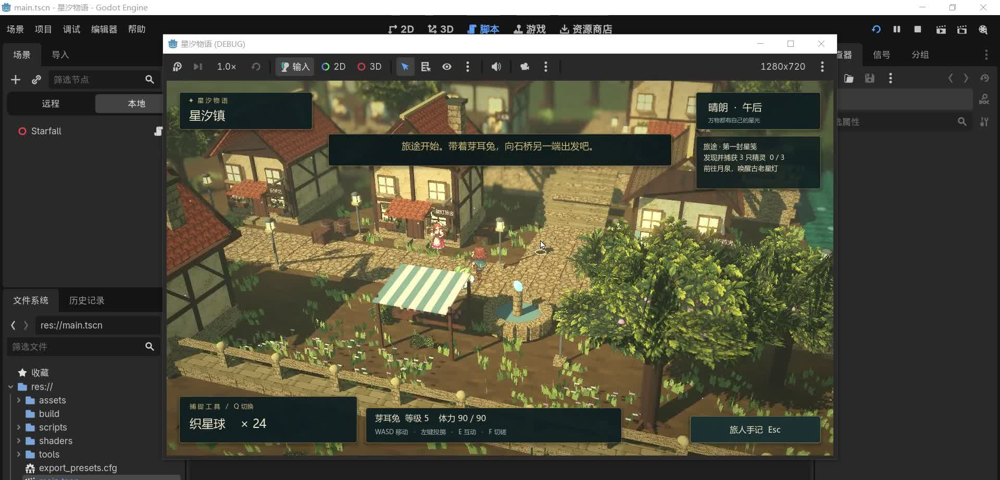
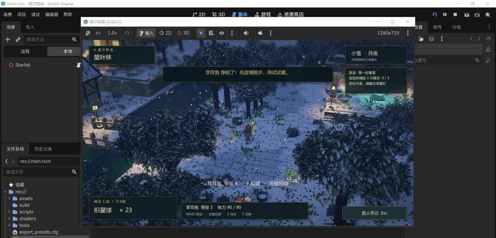

# Godot 游戏制作工坊

**从参考图到可玩版本，把游戏制作中的判断、修复与验收沉淀为可复用的 Skill。**

中文 · Godot · HD-2D · 精灵捕捉 RPG · 自主迭代

## 游戏 Demo

https://github.com/user-attachments/assets/9db74129-0025-4ed1-b1a7-b595018ba29a

[单独打开演示视频](https://github.com/user-attachments/assets/9db74129-0025-4ed1-b1a7-b595018ba29a) · [下载 Skill 发布包](https://github.com/dcaiwei/godot-game-studio/releases/tag/v0.1.0)

演示来自《星汐物语》开发项目，采用 **2026 年 9 月 22 日更新的视频**，完整时长约 **2 分 22 秒**。网页播放版经过压缩，保留完整画面、时长与原声音轨。

这段视频展示了整理本 Skill 所依据的游戏项目。Skill 由制作过程、用户反馈和原始设计要求提炼而来，不代表已经通过“仅调用 Skill 就从零完成同等游戏”的独立端到端评测。本仓库提供 Skill 与演示资料，游戏工程不包含在安装包中。

<details>
<summary>查看白天与夜晚实机截图</summary>

| 白天探索 | 夜间雪景 |
| --- | --- |
|  |  |

</details>

## 它能帮助你做什么

- **从零制作游戏**：分析参考图，建立项目，统一视觉样片，完成核心循环、中文界面、存档和可玩版本导出。
- **继续现有项目**：恢复工程状态，保留已有内容与认可的调整，按优先级完善并验证。
- **修复具体体验**：定位角色大小闪烁、宠物滑行、起停尺寸变化、脚步过吵及昼夜混音等问题。
- **评估玩法完整度**：检查目标链、成长、队伍策略、经济和失败恢复，避免把功能数量等同于游戏完成度。

默认方向为温馨、原创、简体中文的 **HD-2D 精灵捕捉 RPG**。明确指定的题材和范围优先；制作解谜等其他游戏时，不会强制加入精灵捕捉规则。

## 安装

在支持 Skill 的 Codex 环境中，把下面这段话发送给内置安装器：

```text
使用 $skill-installer，从以下 GitHub 地址安装 godot-game-studio：
https://github.com/dcaiwei/godot-game-studio/tree/main/skills/godot-game-studio
```

也可以下载 [Release 中的 Skill 压缩包](https://github.com/dcaiwei/godot-game-studio/releases/tag/v0.1.0)，将完整的 `godot-game-studio` 文件夹放入所用客户端支持的 skills 目录。保留 `SKILL.md`、`agents/` 和 `references/` 的相对结构。

安装后通过 `$godot-game-studio` 调用；如果客户端尚未显示它，重新启动客户端后检查。安装器和本地 Skill 发现方式见 [OpenAI 官方说明](https://learn.chatgpt.com/docs/build-skills)。

## 使用示例

**制作新游戏**

```text
使用 $godot-game-studio，根据我提供的参考图，从零制作一款温馨的
中文 HD-2D 精灵捕捉 RPG。自主完成制作、运行检查、修复与 Windows 可玩版本导出。
```

**继续完善**

```text
使用 $godot-game-studio，继续当前 Godot 工程。
先判断核心玩法的缺口，完善目标链、精灵成长与战斗策略，并完成相关测试。
保留已经认可的画面、人物比例和声音设计。
```

**修复动画或声音**

```text
使用 $godot-game-studio，修复宠物站立和奔跑大小不一致、移动像平移的问题。
验证起步、停步、转向、碰墙以及其他精灵是否有同样问题。
```

```text
使用 $godot-game-studio，调整昼夜声音：白天温馨 BGM，夜晚没有探索 BGM，
配轻虫鸣与偶尔的猫头鹰声，夜间脚步柔和些，并检查切换和音量设置。
```

## 沉淀下来的关键规则

| 曾遇到的问题 | Skill 中的处理方式 |
| --- | --- |
| 主角走动时忽大忽小 | 检查图集边界、透明边缘、注册点和共享比例，禁止逐帧按外接框缩放 |
| 宠物只有平移，没有奔跑感 | 用真实步态和碰撞后的位移驱动动画，验证跟随、避障和起停 |
| 宠物静止与奔跑大小不一致 | 统一跨图集的身体尺度、脚底锚点和像素到世界单位的比例 |
| 脚步刺耳或夜间过吵 | 调整素材、落脚时机、包络和昼夜混音，实际试听，不只看音量数值 |
| 有捕捉和战斗，但很快没目标 | 检查探索、挑战、奖励、新目标，以及成长、经济与队伍取舍 |
| 源码改好了，打开的仍是旧版本 | 核对源码与导出产物，独立启动发布版本复验 |

制作循环：**参考分析 → 视觉样片 → 玩法闭环 → 体验整合 → 实际验证 → 修复 → 导出复验**。

## 文件导航

| 文件 | 内容 |
| --- | --- |
| [SKILL.md](skills/godot-game-studio/SKILL.md) | 任务判断、自主工作流程、反馈处理与交付要求 |
| [默认游戏方案](skills/godot-game-studio/references/default-game.md) | 中文 HD-2D 精灵 RPG 的范围、捕捉与外观规则 |
| [视觉与动画](skills/godot-game-studio/references/visual-animation.md) | 参考图分工、场景、图集、比例、步态与跟随 |
| [声音设计](skills/godot-game-studio/references/audio.md) | 昼夜 BGM、环境声、自然脚步与试听 |
| [玩法与存档](skills/godot-game-studio/references/gameplay-save.md) | 目标链、经济、战斗边界、保存与恢复 |
| [验证与交付](skills/godot-game-studio/references/verification-delivery.md) | 证据分层、实际游玩、版本对应与续做状态 |

## 运行前提与验证状态

Skill 是供开发代理执行的工作规范，不包含 Godot 引擎、图像生成或浏览器控制工具。实际制作需要相应引擎、目标平台导出模板、素材工具和运行权限。代理在授权范围内持续推进；需要权限、核心输入或无法绕过的技术阻塞时，会如实说明。

当前已完成 Skill 格式、元数据与内部引用检查，并审阅了八类典型任务情境；这些检查不能替代完整制游实测。工作流要求将逻辑测试、实机画面、音频试听和导出验证分别记录，未执行的检查不得标为通过。
